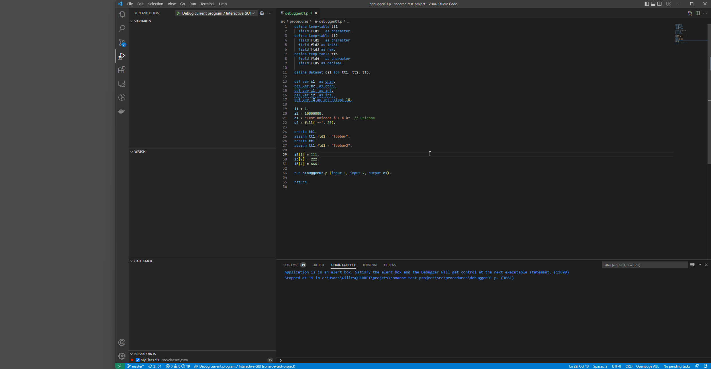

# OpenEdge ABL support for Visual Studio Code
This extension provides rich OpenEdge ABL support for Visual Studio Code.

## Current Status
This extension is based on the existing Christophe Camicas work, but going through a complete overhaul due to the addition of the Language Server. Despite its version number, the extension is currently considered alpha or beta quality software.

## Features
* Syntax highlight
* OpenEdge project configuration (propath, database connections, aliases, ...)
* Multi-thread background compiler
* Profiles
* Debugger
* ABLUnit Support (currently not active)
* Code completion (work in progress)

## Requirements
This extension requires:
* At least one OpenEdge installation, with a developer license. The extension is currently tested with 11.7, 12.2 and later. It may or may not work with older versions.
* Java Virtual Machine version 11 or 17: the language server is written in Java. It is started directly with `java` or with `$JAVA_HOME/bin/java` if the `JAVA_HOME` environment variable is set. It is possible to force the java executable with configuration setting `abl.langServerJavaExecutable`.

## Global Configuration
OpenEdge runtimes have to be declared in VSCode configuration file. Open settings `(Ctrl + comma)` -> Extensions -> ABL Configuration -> Runtimes, or modify `settings.json`:


## Project Configuration
OpenEdge projects can be configured in a file called `openedge-project.json`. This file has to be in the root directory of the project.
```jsonc
{
  "name": "MyProject", // Project name, will be used in the future for dependency management
  "version": "1.0",    // Project version number, will be used in the future for dependency management
  "oeversion": "12.2", // Must reference an existing ABL version in Settings -> Extensions -> ABL Configuration -> Runtimes
  "graphicalMode": true, // True for prowin[32], false for _progres
  "charset": "utf-8",  // Charset 
  "extraParameters": "", // Extra Progress command line parameters
  "buildPath": [
    // Entries can have type 'source' or 'propath'. Path attribute is mandatory. Build attribute is optional (defaults to 'path'). Xref attribute is optional (defaults to 'build/.pct' or '.builder/srcX')
    { "type": "source", "path": "src/procedures" },
    { "type": "source", "path": "src/classes" },
    { "type": "source", "path": "src/dev", "includes": "foo/**,bar/**", "excludes": "foo/something/**" },
    { "type": "propath", "path": "${DLC}/tty/netlib/OpenEdge.net.pl", "documentation": "openedge.json" }
  ],
  "buildDirectory": "build", // Optional global build directory
  "dbConnections": [ // Unlimited number of connections - Beware of -h
    {
      "name": "sp2k", // Logical name of database, or physical name if -ld is not used
      "connect": "-db db/sp2k -RO", // ABL connection string
      "dumpFile": "dump/sp2k.df",   // Database schema, DF format
      "aliases": [ "foo", "bar"]    // List of aliases in ABL session
    }
  ],
  "numThreads": 1, // Number of OpenEdge sessions handling build
  "procedures": [ // List of procedures, started before the main entry point (and after DB connection and propath configuration)
    { "name": "foo/bar.p", "mode": "once" /* Mode can be once, persistent or super */ }
  ],
  "profiles": [ /* See section below */ ]
}
```

## Activation
The extension is activated when a `.p`, `.w` or `.cls` file is opened. ABL actions may fail before the extension is activated.

## Actions & Keyboard Shortcuts
The following actions are defined in this extension (use Ctrl + Shift + P to execute actions):
* Restart ABL Language Server: restart the background Java process (and OpenEdge sessions)
* Rebuild project: delete all rcode and recompile all files
* Open File in AppBuilder: start the AppBuilder (with DB connections and propath) and open current file
* Open Data Dictionary
* Run with Prowin: execute current file in prowin[32] session
* Run with _progres in batch mode: execute current file in _progres session (with `-b`)
* Run with _progres: execute current file (with _progres) in Terminal view 
* Switch to profile: switch current project to another profile
* Fix casing of source code: convert all keywords to uppercase or lowercase

The following keyboard shortcuts are configured by default:
* F2: Run current file (in batch mode with _progres)
* Shift + F8: Open current file in AppBuilder

## Extra Profiles
On top of the default profile configured in `openedge-project.json`, additional profiles can be configured in the `profiles` section. Each profile is defined by a name, parent's name (optional) and a set of values. For example:
```jsonc
{
  /* Default profile values */
  "version": "12.2", "graphicalMode": false, "dbConnections": "-db db/sp2kv12 -RO",
  "profiles": [
    { "name": "V11", "inherits": "default", "value": { "oeversion": "11.7", "dbConnections": "-db db/sp2kv11 -RO" } },
    { "name": "V12.5 GUI", "value": { "oeversion": "12.5", "graphicalMode": true }}
  ]
}
```
V11 Profile inherits from the default profile, so graphicalMode will be set to true. OpenEdge version and DB connections are specified in the profile.
V12.5GUI Profile doesn't inherit from the default profile, so it won't have any DB connection.
When opening a project, VSCode will check for `.vscode/profile.json`. If this file is present, then this profile will be loaded. Otherwise, the default profile will be used. It is recommended to add this file to the SCM ignore list.

## Debugger

You can use the debugger to debug a procedure belonging to the project, and to debug a remote ABL session (assuming it is debug-ready). It is currently not possible to attach to a PASOE instance, but this is planned for a future release (probably end of 2022).

The debugger supports those features:
- step over, step into, step out, continue, suspend
- breakpoints
- display stack
- display variables (including arrays and objects), temp-tables, buffers, parameters and datasets
- watch / evaluate basic expressions (currently disabled)
- jumping in and out of include files

You first need to create the launch configuration in your `.vscode/launch.json` file ; use `Ctrl + Shift + D` to open the "Run and Debug" view, then click on "Add Configuration" and select one of the ABL options.

```JSON
{
  "version": "0.2.0",
  "configurations": [
    {
      "name": "Debug current program / Interactive GUI",
      "type": "abl",
      "request": "launch",
      "program": "${file}",
      "cwd": "${workspaceFolder}",
      "graphicalMode": true
    }
  ]
}
```

To attach to a remote process, it needs to be [debug-ready](https://docs.progress.com/bundle/openedge-classic-appserver-development-117/page/Attaching-the-Debugger-to-an-AppServer-session.html). The easiest way to achieve that is to add `-debugReady 3099` to the startup parameters (`.pf` file) of your application server.
When debugging a local procedure, VSCode will always start the AVM session with `-debugReady 9999`, so it won't be possible to start two debug sessions at the same time. This limitation will *probably* be lifted in the future. The debugger will also stop at the first instruction, which is always a VSCode specific procedure. You can immediately type `F5` to jump to the first executable line of *your* procedure.


[Full size image](https://raw.githubusercontent.com/vscode-abl/vscode-abl/main/resources/images/debugger.webp)

## Code Analysis in VSCode

Code analysis rules that are part of the [OpenEdge plugin for SonarQube](https://github.com/Riverside-Software/sonar-openedge) can be executed in VSCode. It is currently not possible to use the official SonarLint plugin for VSCode (support will be added later), so your quality profile has to be exported from SonarQube to `.vscode/cabl.json`. This procedure (courtesy of Mike Fechner) will export the quality profile:

```
/*------------------------------------------------------------------------
    File        : convert.p
    Purpose     :

    Syntax      :

    Description :

    Author(s)   : mikef
    Created     : Tue Apr 12 13:28:02 CEST 2022
    Notes       :
  ----------------------------------------------------------------------*/

/* ***************************  Definitions  ************************** */

BLOCK-LEVEL ON ERROR UNDO, THROW.

USING Progress.Json.ObjectModel.* FROM PROPATH.

DEFINE INPUT  PARAMETER pcSonarBackup AS CHARACTER NO-UNDO.
DEFINE INPUT  PARAMETER pcCablJson    AS CHARACTER NO-UNDO.

DEFINE TEMP-TABLE ttRule NO-UNDO
    XML-NODE-NAME "rule":U
    FIELD RuleClassName  AS CHARACTER FORMAT "x(60)":U XML-NODE-NAME "key":U
    FIELD RuleName       AS CHARACTER FORMAT "x(60)":U

    INDEX RuleClassName IS PRIMARY UNIQUE RuleClassName.

DEFINE TEMP-TABLE ttRuleParameters NO-UNDO
    XML-NODE-NAME "parameters":U
    FIELD RuleClassName  AS CHARACTER

    INDEX RuleClassName IS PRIMARY UNIQUE RuleClassName .

DEFINE TEMP-TABLE ttRuleParameter NO-UNDO
    XML-NODE-NAME "parameter":U
    FIELD RuleClassName     AS CHARACTER FORMAT "x(30)":U
    FIELD ParameterName     AS CHARACTER FORMAT "x(30)":U XML-NODE-NAME "key":U
    FIELD ParameterValue    AS CHARACTER FORMAT "x(60)":U XML-NODE-NAME "value":U

    INDEX RuleClassName IS PRIMARY UNIQUE RuleClassName ParameterName.

DEFINE DATASET dsRuleRuleParameter
    XML-NODE-NAME "rules":U
    FOR ttRule, ttRuleParameters, ttRuleParameter

    DATA-RELATION relParameters FOR ttRule, ttRuleParameters
        NESTED FOREIGN-KEY-HIDDEN
        RELATION-FIELDS (RuleClassName, RuleClassName)

    DATA-RELATION relParameter FOR ttRuleParameters, ttRuleParameter
        NESTED FOREIGN-KEY-HIDDEN
        RELATION-FIELDS (RuleClassName, RuleClassName) .

DEFINE VARIABLE hDocument   AS HANDLE     NO-UNDO.
DEFINE VARIABLE hRoot       AS HANDLE     NO-UNDO.
DEFINE VARIABLE hRules      AS HANDLE     NO-UNDO.

DEFINE VARIABLE i           AS INTEGER    NO-UNDO .

DEFINE VARIABLE oJson       AS JsonObject NO-UNDO .
DEFINE VARIABLE oRules      AS JsonArray  NO-UNDO .
DEFINE VARIABLE oRule       AS JsonObject NO-UNDO .
DEFINE VARIABLE oParameters AS JsonArray  NO-UNDO .
DEFINE VARIABLE oParameter  AS JsonObject NO-UNDO .
DEFINE VARIABLE iValue      AS INTEGER    NO-UNDO .

/* ***************************  Main Block  *************************** */

CREATE X-DOCUMENT hDocument .
CREATE X-NODEREF hRoot .
CREATE X-NODEREF hRules .

hDocument:LOAD("file":U,
               pcSonarBackup,
               FALSE) .

hDocument:GET-DOCUMENT-ELEMENT(hRoot) .

rules-loop:
DO i = 1 TO hRoot:NUM-CHILDREN:
    hRoot:GET-CHILD(hRules, i) .

    IF hRules:NAME = "rules":U THEN
        LEAVE rules-loop.
END.

DATASET dsRuleRuleParameter:READ-XML ("handle":U, hRules,
                                      "empty":U,
                                      ?, ?, ?, ?).

rules-loop:
FOR EACH ttRule BY ttRule.RuleClassName:
    IF NOT ttRule.RuleClassName BEGINS "eu.rssw.":U THEN DO:
        DELETE ttRule.
        NEXT rules-loop .
    END.

    ASSIGN ttRule.RuleName = ENTRY (NUM-ENTRIES (ttRule.RuleClassName, ".":U), ttRule.RuleClassName, ".":U) .
END.

oJson = NEW JsonObject () .
oRules = NEW JsonArray () .

oJson:Add ("activeRules":U, oRules) .

FOR EACH ttRule BY ttRule.RuleName:
    ASSIGN oRule = NEW JsonObject () .

    oRules:Add (oRule) .

    oRule:Add ("name":U, ttRule.RuleName) .
    oRule:Add ("class":U, ttRule.RuleClassName) .

    IF CAN-FIND (FIRST ttRuleParameter WHERE ttRuleParameter.RuleClassName = ttRule.RuleClassName) THEN DO:
        oParameters = NEW JsonArray () .

        oRule:Add ("parameters":U, oParameters) .

        FOR EACH ttRuleParameter WHERE ttRuleParameter.RuleClassName = ttRule.RuleClassName:
            oParameter = NEW JsonObject () .

            oParameters:Add (oParameter) .

            oParameter:Add ("name":U, ttRuleParameter.ParameterName) .

            IF ttRuleParameter.ParameterValue = "true":U THEN
                oParameter:Add ("value":U, TRUE) .
            ELSE IF ttRuleParameter.ParameterValue = "false":U THEN
                oParameter:Add ("value":U, FALSE) .
            ELSE DO:
                {&_proparse_ prolint-nowarn(avoidnoerror)}
                ASSIGN iValue = INTEGER (ttRuleParameter.ParameterValue) NO-ERROR .

                IF ttRuleParameter.ParameterValue = "":U OR ERROR-STATUS:NUM-MESSAGES > 0 THEN
                    oParameter:Add ("value":U, ttRuleParameter.ParameterValue) .
                ELSE
                    oParameter:Add ("value":U, iValue) .
            END.
        END.
    END.
END.

oJson:WriteFile (pcCablJson, TRUE) .

FINALLY:
    IF VALID-HANDLE (hRules) THEN
        DELETE OBJECT hRules.

    IF VALID-HANDLE (hRoot) THEN
        DELETE OBJECT hRoot.

    IF VALID-HANDLE (hDocument) THEN
        DELETE OBJECT hDocument .
END FINALLY.
```

CABL rules execution required a valid license; please send an email to contact@riverside-software.fr to receive your license (if you have an active subscription).

## Unit tests

** Unit tests are currently inactive **

Based upon the ABLUnit framework (need to be installed locally), you can specify launch parameters to find and execute test files
```
{
    "test": {
        "files":[
            "tests/*.test.p"
        ],
        "beforeEach": {
            "cmd": "%ProgramFiles%\\Git\\bin\\sh.exe",
            "args": [
                "-c",
                "echo starting"
            ]
        },
        "afterEach": {
            "cmd": "%ProgramFiles%\\Git\\bin\\sh.exe",
            "args": [
                "-c",
                "echo done"
            ]
        }
    }
}
```

## Configuration checklist

Here are a few things to verify before opening [issues](https://github.com/vscode-abl/vscode-abl/issues/new):
* Java 11 has to be present in the PATH (check output of `java -version`)
* OpenEdge has to be installed on your local machine, and configured in VSCode. As of today, versions 11.7, 12.2, 12.5 and 12.6 have been tested.
* Verify that the openedge-project.json is present in the root directory, and has no syntax error
* Make sure at least one .p or .cls is opened, as the extension is not active by default
* Check the Java command line being executed (using Process Explorer for example)
* Check the OE command line being execute (also using Process Explorer for example)
* Check the .builder directory in your project, it contains valuable log files
* Make sure you have `source` directories in your configuration file ; `propath` entries are not monitored and thus nothing would be recompiled

## Greetings
Initial plugin development done by [chriscamicas](https://github.com/chriscamicas). In turn, largely inspired by ZaphyrVonGenevese work (https://github.com/ZaphyrVonGenevese/vscode-abl).
Also inspired by vscode-go and vscode-rust extensions.

Thanks to all the contributors: mscheblein

## License
VSCode Plugin Code is licensed under the [MIT](LICENSE) License.
Language Server code is (c) Copyright Riverside Software.
